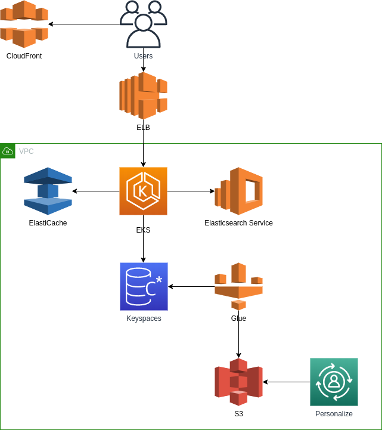

# Assumption of the Case 

Imagine that you meet with a small gaming startup company in the early stages of their operations. They have already launched 1 light games. Currently they use single MYSQL database running on one host to store all the data. Like many small start-ups they are confident that they will be the next big thing and expect significant, rapid, yet unquantified growth in the next few months. Actually they would develop v2.0 game which would be a more complex game. They want to review the design of database before the development. In v2.0 game, the requirement of database would be:
- They would store various data in database such as metadata, transaction data, session data, log data etc.
- Most of the operation of the data is quite simple query, but also has some complex query.
- The number of concurrent access to database could be very large and not stable.
- They want the performance won’t be degrade even the size of data grows up rapidly.
- The history data in v1.0 database should be migrated to v2.0 database.
- Their games just need 1 year data in most case, the history data would be used for analytics.
- They would like to develop the global uniform game in the future. So they need the database can be launched in many regions to speed up the data access of the players in the world.
- They would like to add recommendation feature based on relationships between information such as player interests, friends, and purchase history etc.

#	Executive Summary

## Requirements Analysis 

- Scaling to meet the demand, but with uncertainty around when and how much this demand will be they are very concerned about buying too much infrastructure too soon or not enough too late!
- Their lack of provision for Disaster Recovery their ability to configure their database and data access layer for high performance and throughput
- Making the player experience very low latency even though a large portion of their user base will be from far away
- Effective distribution of load a self-healing infrastructure that recovers

# Solution Design

## Architecture Overview 



## Design Details 

### Keyspaces


Features: Why do we choose Apache Cassandra or Amazon Keyspaces

*** Note: Keyspaces is compatible with Apache Cassandra ***

- Fault Tolerant: Data is automatically replicated to multiple nodes for fault-tolerance. Replication across multiple data centers is supported. Failed nodes can be replaced with no downtime.
- Decentralized: There are no single points of failure. There are no network bottlenecks. Every node in the cluster is identical.
- Scalable: Some of the largest production deployments include Apple's, with over 75,000 nodes storing over 10 PB of data, Netflix (2,500 nodes, 420 TB, over 1 trillion requests per day), Chinese search engine Easou (270 nodes, 300 TB, over 800 million requests per day),  and eBay (over 100 nodes, 250 TB).
- Durable: Cassandra is suitable for applications that can't afford to lose data, even when an entire data center goes down.
- Elastic: Read and write throughput both increase linearly as new machines are added, with no downtime or interruption to applications.
- Guarantee Replication: Choose between synchronous or asynchronous replication for each update. Highly available asynchronous operations are optimized with features like Hinted Handoff and Read Repair.

Maintains: How do we use Apache Cassandra or Amazon Keyspaces

*** Note: Differences between Amazon Keyspaces and Apache Cassandra ***

| Item | Apache Cassandra | Amazon Keyspaces |
| - | - | - |
| Monitoring | Prometheus, Grafana | There is a Dashboard for monitoring Performance and Error |
| No servers to manage | EC2 | You don’t have to provision, patch, or manage servers, which allows you to focus on building better applications. Capacity is on-demand you pay for only the resources you use and you don’t have to plan for peak workloads. With provisioned capacity mode, you specify the number of reads and writes per second that you expect your application to perform. |
| Highly available and secure | replicas, openssl | Tables are encrypted by default and replicated three times in multiple AWS Availability Zones for high availability. Secure your data with access management, and use performance monitoring to keep your applications running smoothly. |
| Performance at scale | Add more EC2 | Consistent, single-digit-millisecond response times at any scale. Build applications with virtually unlimited throughput and storage, that can serve thousands of requests per second without capacity planning. |
| Recovery | Snapshot | Point-in-time recovery (PITR) helps protect your Amazon Keyspaces tables from accidental write or delete operations by providing you continuous backups of your table data for 35 days (at no additional cost) |

Costs: Assumption as below
- 1 datacenter in a region
- 3 replicas of data
- 1 Gbps network bandwidth
- 1,000 write per sec with LOCAL_QUORUM, each request data size is 1KB, 1MBs, ~30TB per year disk usage 
- 1,000 read per sec with LOCAL_QUORUM, each response data size is 4KB, 4MBs, ~125TB per year

| Item | Price | Comments |
| - | - | - |
| Apache Cassandra on EC2 | ~$107,000 per year | 9 ec2 with t2.2xlarge: $2,374*9=$21,000, Storage 200TB: $0.12*30,000GB*12=$86,000 |
| Amazon Keyspaces | ~$183,000 per year | On-demand mode, WRU: $1.6508*30,000GB=$50,000, RRU: $0.331*30,000GB=$10,000, Storage: $0.34*30,000GB*12=$123,000 |

Summary:
| Item | Apache Cassandra | Amazon Keyspaces |
| - | - | - |
| Features | All | Almost |
| Maintains | Self managed | Most of works managed by AWS |
| Costs | ~$107,000 per year | ~$183,000 per year | 

References:
- [Security](https://docs.aws.amazon.com/keyspaces/latest/devguide/security.html)
- [Amazon Keyspaces (for Apache Cassandra) pricing](https://amazonaws-china.com/keyspaces/pricing/)
- [Quotas for Amazon Keyspaces (for Apache Cassandra)](https://docs.aws.amazon.com/keyspaces/latest/devguide/quotas.html)
- [Standard and Convertible Reserved Instances Pricing](https://amazonaws-china.com/ec2/pricing/reserved-instances/pricing/)
- [Amazon EBS pricing](https://amazonaws-china.com/ebs/pricing/)
- [Preparing SSL certificates for production](https://docs.datastax.com/en/ddacsecurity/doc/ddacsecurity/secureSSLCertWithCA.html)
- [Prometheus JMX Exporter](https://github.com/prometheus/jmx_exporter)

Data model in Keyspaces or Cassandra:

```sql
CREATE KEYSPACE IF NOT EXISTS game WITH replication = {'class': 'NetworkTopologyStrategy', 'datacenter1': 1};
```

- users table
  - name field query frequence is more than others fields, and it is unique in system
  - if we want to query by other fields, email, phone or age, we could import these fields or all fields into Elasticsearch, and update other fields when user info changed, user info is seldom to update.

```sql
CREATE TABLE IF NOT EXISTS game.users (
  id timeuuid,
  name text,
  password text, -- MD5
  age int,
  email text,
  phone text,
  created_at timestamp,
  updated_at timestamp,
  PRIMARY KEY (name)
);
```

- orders table
  - query orders by user_name
  - order by id DESC can make query efficiently
  - using Lightweight for transactions if necessary

```sql
CREATE TABLE IF NOT EXISTS game.orders (
  id timeuuid,
  user_name text,
  item text,
  amount int,
  price decimal,
  status text, -- [paid|unpaid]
  created_at timestamp,
  updated_at timestamp,
  PRIMARY KEY (user_name, id)
) WITH CLUSTERING ORDER BY (id DESC);
```

- messages table
  - query message by user_name, both sender and receiver
  - order by id DESC can make query efficiently
  - set ttl 1 year

```sql
CREATE TABLE IF NOT EXISTS game.messages_by_sender (
  sender_user_name text,
  receiver_user_name text,
  id timestamp,
  message text,
  created_at timestamp,
  updated_at timestamp,
  PRIMARY KEY (sender_user_name, receiver_user_name, id)
) WITH CLUSTERING ORDER BY (receiver_user_name ASC, id DESC)
  AND default_time_to_live = 31536000;

-- double write

CREATE TABLE IF NOT EXISTS game.messages_by_receiver (
  sender_user_name text,
  receiver_user_name text,
  id timestamp,
  message text,
  created_at timestamp,
  updated_at timestamp,
  PRIMARY KEY (receiver_user_name, sender_user_name, id)
) WITH CLUSTERING ORDER BY (sender_user_name ASC, id DESC)
  AND default_time_to_live = 31536000;

-- or MATERIALIZED VIEW

CREATE MATERIALIZED VIEW IF NOT EXISTS game.messages_by_receiver 
  AS SELECT * 
  FROM game.messages_by_sender
  WHERE receiver_user_name IS NOT NULL
  AND sender_user_name IS NOT NULL
  AND id IS NOT NULL
  PRIMARY KEY (receiver_user_name, sender_user_name, id)
  WITH CLUSTERING ORDER BY (sender_user_name ASC, id DESC);

-- or import message data into Elasticsearch

```

QAs:

Q: They would store various data in database such as metadata, transaction data, session data, log data etc. 
- Yes, but there is a limit supported for transaction

Q: Most of the operation of the data is quite simple query, but also has some complex query.
- For quite simple query, it must be query by primay key, although we can make secondary index.
- For some complex query, we can make materialized view or wide table.

Q: The number of concurrent access to database could be very large and not stable.
- We could setup a small datacenter at beginning for saving cost
- We could scale datacenter by adding new nodes, cassandra will balance data by itself. 

Q: They want the performance won’t be degrade even the size of data grows up rapidly.
- We could do read/write splitting, ex: setup 2 datacenters, one for read, one for write.

Q: The history data in v1.0 database should be migrated to v2.0 database.
- We could use [COPY FROM](https://docs.datastax.com/en/ddaccql/doc/cql/cql_reference/cqlsh_commands/cqlshCopyFrom.html) to import data with csv format
- Modify the default for the COPY FROM option in the configuration file path_to_file/.cassandra/cqlshrc and add the following lines.[Optimize](https://amazonaws-china.com/blogs/database/loading-data-into-amazon-mcs-with-cqlsh/)

Q: Their games just need 1 year data in most case, the history data would be used for analytics.
- We could set TTL for the data which need only 1 year

Q: They would like to develop the global uniform game in the future. So they need the database can be launched in many regions to speed up the data access of the players in the world.
- We could setup new datacenters in many regions
- Authentication provider: Create the authentication provider with the PlainTextAuthProvider class. ServiceUserName and ServicePassword should match the user name and password you obtained when you generated the service-specific credentials by following the steps in Generate Service-Specific Credentials.
- Local data center: Set the value for local-datacenter to the Region you're connecting to. For example, if the application is connecting to cassandra.us-east-2.amazonaws.com, then set the local data center to us-east-2. For all available AWS Regions, see Service Endpoints for Amazon Keyspaces.
- SSL/TLS: Initialize the SSLEngineFactory by adding a section in the configuration file with a single line that specifies the class with class = DefaultSslEngineFactory. Provide the path to the trustStore file and the password that you created previously.

### Elasticsearch Service


Why do we choose Elasticesearch Service?
- When we meet some complex query in Cassandra, there is not too much ways. so we need a third component to do it, Elasticsearch

How to use Elasticsearch Service?
- Setup Elasticsearch Cluster for each region

Costs: Amazon Elasticsearch Service estimate
| Item | Price |
| - | - |
| Elasticsearch data instance cost (monthly) | 0.00 USD |
| Elasticsearch dedicated master instance cost (monthly) | 0.00 USD |
| UltraWarm total cost (monthly) | 5,223.46 USD |
| Elasticsearch EBS storage cost (monthly) | 4,976.64 USD |
| Total monthly cost: | 10,200.10 USD |
| Elasticsearch data instance cost (upfront) | 11,634.00 USD |
| Elasticsearch dedicated master instance cost (upfront) | 11,634.00 USD |
| Total upfront cost: | 23,268.00 USD |

References:
- [Amazon Elasticsearch Service pricing](https://amazonaws-china.com/elasticsearch-service/pricing/)
- [Configure Amazon Elasticsearch Service](https://calculator.aws/#/createCalculator)

Data templates in Elasticsearch or Elasticsearch Service:

- users template

```json
PUT _index_template/users
{
  "index_patterns": [
    "users-*"
  ],
  "template": {
    "settings": {
      "index": {
        "refresh_interval": "1s",
        "number_of_shards": "3",
        "number_of_replicas": "2"
      }
    },
    "mappings": {
      "dynamic": false,
      "properties": {
        "id": {
          "type": "keyword"
        },
        "name": {
          "type": "keyword"
        },
        "age": {
          "type": "short"
        },        
        "email": {
          "type": "keyword"
        },
        "phone": {
          "type": "keyword"
        },
        "created_at": {
          "type": "date"
        }
      }
    }
  },
  "composed_of": [],
  "priority": 1,
  "version": 1
}

// update user info incremental
// or we also could build new index daily
POST /_aliases
{
  "actions" : [
    { "add" : { "index" : "users-20200810", "alias" : "users" } },
    { "remove" : { "index" : "users-20200809", "alias" : "users" } }    
  ]
}
```

- orders template
  - keeping all orders history
  - creating new index for orders monthly

```json
PUT _index_template/orders
{
  "index_patterns": [
    "orders-*"
  ],
  "template": {
    "settings": {
      "index": {
        "lifecycle": {
          "name": "orders",
          "rollover_alias": "orders"
        },        
        "refresh_interval": "1s",
        "number_of_shards": "3",
        "number_of_replicas": "2"
      }
    },
    "mappings": {
      "dynamic": false,
      "properties": {
        "id": {
          "type": "keyword"
        },
        "user_name": {
          "type": "keyword"
        },
        "amount": {
          "type": "integer"
        },        
        "price": {
          "type": "double"
        },
        "status": {
          "type": "keyword"
        },
        "created_at": {
          "type": "date"
        }
      }
    }
  },
  "composed_of": [],
  "priority": 1,
  "version": 1
}

PUT _ilm/policy/orders
{
  "policy": {
    "phases": {
      "hot": {
        "min_age": "0ms",
        "actions": {
          "rollover": {
            "max_size": "30GB",
            "max_age": "30d"
          },
          "set_priority": {
            "priority": 100
          }
        }
      },
      "warm": {
        "actions": {
          "readonly" : { },
          "set_priority": {
            "priority": 50
          }
        }
      }
    }
  }
}

PUT orders-000001
{
  "aliases": {
    "orders":{
      "is_write_index": true 
    }
  }
}
```

- messages template
  - we do not search by message
  - keeping 1 year message history
  - creating new index for messages weekly

```json
PUT _index_template/messages
{
  "index_patterns": [
    "messages-*"
  ],
  "template": {
    "settings": {
      "index": {    
        "lifecycle": {
          "name": "messages",
          "rollover_alias": "messages"
        },            
        "refresh_interval": "1s",
        "number_of_shards": "3",
        "number_of_replicas": "2"
      }
    },
    "mappings": {
      "dynamic": false,
      "properties": {
        "id": {
          "type": "keyword"
        },
        "sender_user_name": {
          "type": "keyword"
        },
        "receiver_user_name": {
          "type": "keyword"
        },
        "message": {
          "type": "text",
          "index": false
        },        
        "created_at": {
          "type": "date"
        }
      }
    }
  },
  "composed_of": [],
  "priority": 1,
  "version": 1
}

PUT _ilm/policy/messages
{
  "policy": {
    "phases": {
      "hot": {
        "min_age": "0ms",
        "actions": {
          "rollover": {
            "max_size": "30GB",
            "max_age": "7d"
          },
          "set_priority": {
            "priority": 100
          }
        }
      },
      "warm": {
        "actions": {
          "readonly" : { },
          "set_priority": {
            "priority": 50
          }
        }
      },
      "delete": {
        "min_age": "365d",
        "actions": {
          "delete": {
            "delete_searchable_snapshot": true
          }
        }
      }      
    }
  }
}

PUT messages-000001
{
  "aliases": {
    "messages":{
      "is_write_index": true 
    }
  }
}
```

QAs:

Q: How to load streaming data into Elasticsearch
- Application write directly
- Logstash
- Lambda

```python
import boto3
import json
import requests
from requests_aws4auth import AWS4Auth

region = '' # e.g. us-west-1
service = 'es'
credentials = boto3.Session().get_credentials()
awsauth = AWS4Auth(credentials.access_key, credentials.secret_key, region, service, session_token=credentials.token)

host = '' # the Amazon ES domain, including https://
headers = { "Content-Type": "application/json" }

def lambda_handler(event, context):
  #print("Received event: " + json.dumps(event, indent=2))

  index = event['index']
  url = host + '/' + index + '/_doc/'

  operation = event['httpMethod']
  if operation == 'DELETE':
    id = event['id']
    return requests.delete(url + id, auth=awsauth)
  else:
    document = event['doc']
    return requests.post(url, auth=awsauth, json=document, headers=headers)     
```

Q: Most of the operation of the data is quite simple query, but also has some complex query.
- We could use elasticsearch for complex query, ex: query friends by name, age or email
- We could only use keyword type for string in elasticsearch for query if we do not care about fulltext search.


### ElatiCache

QAs:

Q: They would like to develop the global uniform game in the future. So they need the database can be launched in many regions to speed up the data access of the players in the world.
- We could load some data (lookup, static, session or hot data) from cassandra into Redis Cluster to speed up the data access


### Glue for ETL

QAs:

Q: Their games just need 1 year data in most case, the history data would be used for analytics.
- We could archive history data into S3 with csv format for analytics, like recommendation feature. [Connect to Cassandra Data in AWS Glue Jobs Using JDBC](https://www.cdata.com/kb/tech/cassandra-jdbc-aws-glue.rst)


### Personalize for recommendation

QAs:

Q: They would like to add recommendation feature based on relationships between information such as player interests, friends, and purchase history etc.
- Yes
