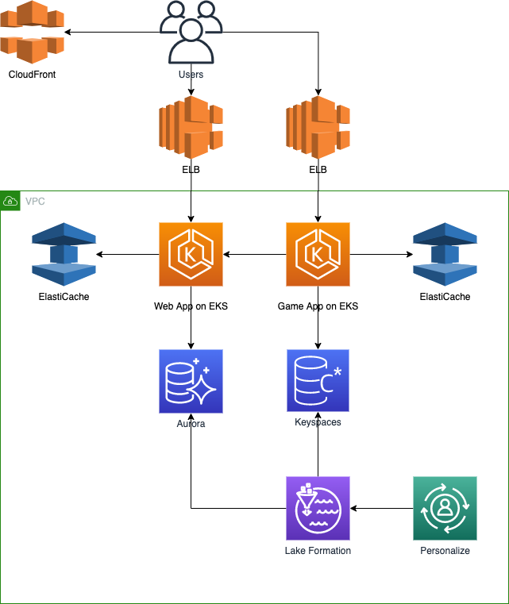
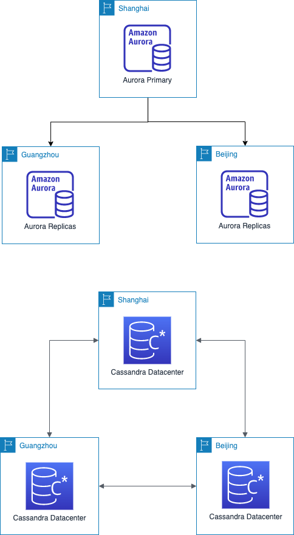

# Assumption of the Case 

Imagine that you meet with a small gaming startup company in the early stages of their operations. They have already launched 1 light games. Currently they use single MYSQL database running on one host to store all the data. Like many small start-ups they are confident that they will be the next big thing and expect significant, rapid, yet unquantified growth in the next few months. Actually they would develop v2.0 game which would be a more complex game. They want to review the design of database before the development. In v2.0 game, the requirement of database would be:
- They would store various data in database such as metadata, transaction data, session data, log data etc.
- Most of the operation of the data is quite simple query, but also has some complex query.
- The number of concurrent access to database could be very large and not stable.
- They want the performance won’t be degrade even the size of data grows up rapidly.
- The history data in v1.0 database should be migrated to v2.0 database.
- Their games just need 1 year data in most case, the history data would be used for analytics.
- They would like to develop the global uniform game in the future. So they need the database can be launched in many regions to speed up the data access of the players in the world.
- They would like to add recommendation feature based on relationships between information such as player interests, friends, and purchase history etc.

#	Executive Summary

## Requirements Analysis 

- Scaling to meet the demand, but with uncertainty around when and how much this demand will be they are very concerned about buying too much infrastructure too soon or not enough too late!
- Their lack of provision for Disaster Recovery their ability to configure their database and data access layer for high performance and throughput
- Making the player experience very low latency even though a large portion of their user base will be from far away
- Effective distribution of load a self-healing infrastructure that recovers

# Solution Design

## Architecture Overview 

This is only for one region, like China. If they decide to launch other regions, they just launch the same architecture more times.

## Design Details 

### Aurora for web app

Description:
- Transation data, ex: orders, payments
- Write less than read
- Compatible with game v1 mysql database
- Data Migration easy
- Low threshold for mysql developers
- We can setup more replicas for scaling read capacity and performance in one region

Benefits:
- High Performance and Scalability
  - Get 5X the throughput of standard MySQL and 3X the throughput of standard PostgreSQL.
  - This performance is on par with commercial databases, at 1/10th the cost.
  - You can easily scale your database deployment up and down from smaller to larger instance types as your needs change, or let Aurora Serverless handle scaling automatically for you.
  - To scale read capacity and performance, you can add up to 15 low latency read replicas across three Availability Zones.
  - Amazon Aurora automatically grows storage as needed, up to 64TB per database instance.
- High Availability and Durability
  - Amazon Aurora is designed to offer greater than 99.99% availability, replicating 6 copies of your data across 3 Availability Zones and backing up your data continuously to Amazon S3.
  - It transparently recovers from physical storage failures; instance failover typically takes less than 30 seconds.
  - You can also backtrack within seconds to a previous point in time, to recover from user errors. With Global Database, a single Aurora database can span multiple AWS regions to enable fast local reads and quick disaster recovery.
- Highly Secure
  - Amazon Aurora provides multiple levels of security for your database. 
  - These include network isolation using Amazon VPC, encryption at rest using keys you create and control through AWS Key Management Service (KMS) and encryption of data in transit using SSL. 
  - On an encrypted Amazon Aurora instance, data in the underlying storage is encrypted, as are the automated backups, snapshots, and replicas in the same cluster.
- MySQL and PostgreSQL Compatible
  - The Amazon Aurora database engine is fully compatible with existing MySQL and PostgreSQL open source databases, and adds compatibility for new releases regularly. 
  - This means you can easily migrate MySQL or PostgreSQL databases to Aurora using standard MySQL or PostgreSQL import/export tools or snapshots. 
  - It also means the code, applications, drivers, and tools you already use with your existing databases can be used with Amazon Aurora with little or no change.
- Fully Managed
  - Amazon Aurora is fully managed by Amazon Relational Database Service (RDS). 
  - You no longer need to worry about database management tasks such as hardware provisioning, software patching, setup, configuration, or backups. 
  - Aurora automatically and continuously monitors and backs up your database to Amazon S3, enabling granular point-in-time recovery. 
  - You can monitor database performance using Amazon CloudWatch, Enhanced Monitoring, or Performance Insights, an easy-to-use tool that helps you quickly detect performance problems.
- Migration Support
  - MySQL and PostgreSQL compatibility make Amazon Aurora a compelling target for database migrations to the cloud. If you're migrating from MySQL or PostgreSQL, see our migration documentation for a list of tools and options. To migrate from commercial database engines, you can use the AWS Database Migration Service for a secure migration with minimal downtime.

### Keyspaces for game app data about 1 year

Description:
- High read and write throughputs
- High concurrent access
- We can setup multiple datacenters in one region for scaling read/write capacity and performance in one region
- We can set replication factor 3 or high each datacenter for HA
- Repairing data local datacenter everyday
- Repairing data across datacenters weekly

Benefits:
- Compatible with Apache Cassandra
  - Amazon Keyspaces enables you to use the Cassandra Query Language (CQL) API code, Cassandra drivers, and developer tools that you already use. 
  - Updating applications to use Amazon Keyspaces is as easy as changing the Cassandra hostname to the Amazon Keyspaces service endpoint.
- No servers to manage
  - You don’t need to provision, patch, or manage servers, so you can focus on building better applications.
  - Tables can scale up and down automatically, and you can optimize the cost of reads and writes based on your application’s traffic patterns by choosing either on-demand or provisioned capacity mode.
- Performance at scale
  - Consistent, single-digit-millisecond response times at any scale. 
  - Build applications with virtually unlimited throughput and storage that can serve thousands of requests per second without the need for capacity planning. 
  - You can monitor performance by using Amazon CloudWatch to help keep your applications running smoothly.
- Highly available and secure
  - Amazon Keyspaces offers a 99.99% availability SLA within an AWS Region. 
  - Tables are encrypted by default and replicated three times in multiple AWS Availability Zones for high availability. 
  - You can create continuous table backups with hundreds of terabytes of data with no performance impact to your application, and recover to any point in time in the preceding 35 days.

### ElatiCache

Benefits:
- Extreme performance
  - Amazon ElastiCache works as an in-memory data store and cache to support the most demanding applications requiring sub-millisecond response times. 
  - By utilizing an end-to-end optimized stack running on customer dedicated nodes, Amazon ElastiCache provides secure, blazing fast performance.
- Fully Managed
  - You no longer need to perform management tasks such as hardware provisioning, software patching, setup, configuration, monitoring, failure recovery, and backups. 
  - ElastiCache continuously monitors your clusters to keep your workloads up and running so that you can focus on higher value application development.
- Scalable
  - Amazon ElastiCache can scale-out, scale-in, and scale-up to meet fluctuating application demands. 
  - Write and memory scaling is supported with sharding. 
  - Replicas provide read scaling.

### Glue for ETL

Benefits:
- Less hassle
  - AWS Glue is integrated across a wide range of AWS services, meaning less hassle for you when onboarding. 
  - AWS Glue natively supports data stored in Amazon Aurora and all other Amazon RDS engines, Amazon Redshift, and Amazon S3, as well as common database engines and databases in your Virtual Private Cloud (Amazon VPC) running on Amazon EC2.
- Cost effective
  - AWS Glue is serverless. There is no infrastructure to provision or manage. AWS Glue handles provisioning, configuration, and scaling of the resources required to run your ETL jobs on a fully managed, scale-out Apache Spark environment. You pay only for the resources used while your jobs are running.
- More power
  - AWS Glue automates much of the effort in building, maintaining, and running ETL jobs. AWS Glue crawls your data sources, identifies data formats, and suggests schemas and transformations. 
  - AWS Glue automatically generates the code to execute your data transformations and loading processes.

### Lake Formation for history data

Benefits:
- Build data lakes quickly
  - With Lake Formation, you can move, store, catalog, and clean your data faster. 
  - You simply point Lake Formation at your data sources, and Lake Formation crawls those sources and moves the data into your new Amazon S3 data lake. 
  - Lake Formation organizes data in S3 around frequently used query terms and into right-sized chunks to increase efficiency. 
  - Lake Formation also changes data into formats like Apache Parquet and ORC for faster analytics. 
  - In addition, Lake Formation has built-in machine learning to deduplicate and find matching records (two entries that refer to the same thing) to increase data quality.
- Simplify security management
  - You can use Lake Formation to centrally define security, governance, and auditing policies in one place, versus doing these tasks per service, and then enforce those policies for your users across their analytics applications. 
  - Your policies are consistently implemented, eliminating the need to manually configure them across security services like AWS Identity and Access Management and AWS Key Management Service, storage services like S3, and analytics and machine learning services like Redshift, Athena, and (in beta) EMR for Apache Spark. 
  - This reduces the effort in configuring policies across services and provides consistent enforcement and compliance.
- Provide self-service access to data
  - With Lake Formation you build a data catalog that describes the different data sets that are available along with which groups of users have access to each. 
  - This makes your users more productive by helping them find the right data set to analyze. By providing a catalog of your data with consistent security enforcement, Lake Formation makes it easier for your analysts and data scientists to use their preferred analytics service.
  - They can use EMR for Apache Spark (in beta), Redshift, or Athena on diverse data sets now housed in a single data lake. Users can also combine these services without having to move data between silos.

### Personalize for recommendation

Benefits and features:
- No machine learning experience required
  - Significant machine learning expertise is typically required to build effective personalization models. 
  - Amazon Personalize includes AutoML capabilities that eliminate this challenge by taking care of the machine learning for you.
- Continuous learning to improve performance
  - Learn from every user interaction and continually improve your user engagement. 
  - Amazon Personalize automatically tracks the performance of key business metrics and retrains models based on the latest, up-to-date user and item data. 
  - The closed feedback loop enables Amazon Personalize to continuously calibrate to individual preferences and deliver dynamic, personalized experiences.
- Based on the same technology used at Amazon.com
  - Amazon Personalize includes algorithms that are based on over twenty years of personalization experience and developed expertise used in running the Amazon.com retail business. 
  - Personalize will automatically select the best algorithm base on your specific datasets.
 
# References 

- [Amazon Aurora](https://amazonaws-china.com/rds/aurora/?nc1=h_ls)
- [Connect to Cassandra Data in AWS Glue Jobs Using JDBC](https://www.cdata.com/kb/tech/cassandra-jdbc-aws-glue.rst)