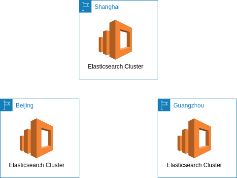

# Assumption of the Case 

Imagine that you meet with a small gaming startup company in the early stages of their operations. They have already launched 1 light games. Currently they use single MYSQL database running on one host to store all the data. Like many small start-ups they are confident that they will be the next big thing and expect significant, rapid, yet unquantified growth in the next few months. Actually they would develop v2.0 game which would be a more complex game. They want to review the design of database before the development. In v2.0 game, the requirement of database would be:
- They would store various data in database such as metadata, transaction data, session data, log data etc.
- Most of the operation of the data is quite simple query, but also has some complex query.
- The number of concurrent access to database could be very large and not stable.
- They want the performance won’t be degrade even the size of data grows up rapidly.
- The history data in v1.0 database should be migrated to v2.0 database.
- Their games just need 1 year data in most case, the history data would be used for analytics.
- They would like to develop the global uniform game in the future. So they need the database can be launched in many regions to speed up the data access of the players in the world.
- They would like to add recommendation feature based on relationships between information such as player interests, friends, and purchase history etc.

#	Executive Summary

## Requirements Analysis 

- Scaling to meet the demand, but with uncertainty around when and how much this demand will be they are very concerned about buying too much infrastructure too soon or not enough too late!
- Their lack of provision for Disaster Recovery their ability to configure their database and data access layer for high performance and throughput
- Making the player experience very low latency even though a large portion of their user base will be from far away
- Effective distribution of load a self-healing infrastructure that recovers

# Solution Design

## Architecture Overview 


## Design Details 

### MongoDB


QAs:

Q: They would store various data in database such as metadata, transaction data, session data, log data etc. 
- Yes

Q: Most of the operation of the data is quite simple query, but also has some complex query.
- For quite simple query, it must be query by primay key, although we can make secondary index.
- For some complex query, we can make document model.

Q: The number of concurrent access to database could be very large and not stable.
- We could setup a small datacenter at beginning for saving cost
- We could scale datacenter by adding new nodes, mongodb will balance data by itself. 

Q: They want the performance won’t be degrade even the size of data grows up rapidly.
- We could add more shards.

Q: The history data in v1.0 database should be migrated to v2.0 database.
- 

Q: Their games just need 1 year data in most case, the history data would be used for analytics.
- We could set TTL for the data which need only 1 year

Q: They would like to develop the global uniform game in the future. So they need the database can be launched in many regions to speed up the data access of the players in the world.
- We could setup new datacenters in many regions


### Elasticsearch Service



QAs:

Q: How to load streaming data into Elasticsearch
- Application write directly
- Logstash
- Lambda

```python
import boto3
import json
import requests
from requests_aws4auth import AWS4Auth

region = '' # e.g. us-west-1
service = 'es'
credentials = boto3.Session().get_credentials()
awsauth = AWS4Auth(credentials.access_key, credentials.secret_key, region, service, session_token=credentials.token)

host = '' # the Amazon ES domain, including https://
headers = { "Content-Type": "application/json" }

def lambda_handler(event, context):
  #print("Received event: " + json.dumps(event, indent=2))

  index = event['index']
  url = host + '/' + index + '/_doc/'

  operation = event['httpMethod']
  if operation == 'DELETE':
    id = event['id']
    return requests.delete(url + id, auth=awsauth)
  else:
    document = event['doc']
    return requests.post(url, auth=awsauth, json=document, headers=headers)     
```

Q: Most of the operation of the data is quite simple query, but also has some complex query.
- We could use elasticsearch for complex query, ex: query friends by name, age or email
- We could only use keyword type for string in elasticsearch for query if we do not care about fulltext search.


### ElatiCache

QAs:

Q: They would like to develop the global uniform game in the future. So they need the database can be launched in many regions to speed up the data access of the players in the world.
- We could load some data (lookup, static, session or hot data) from cassandra into Redis Cluster to speed up the data access


### Glue for ETL

QAs:

Q: Their games just need 1 year data in most case, the history data would be used for analytics.
- We could archive history data into S3 with csv format for analytics, like recommendation feature. [Connect to Cassandra Data in AWS Glue Jobs Using JDBC](https://www.cdata.com/kb/tech/cassandra-jdbc-aws-glue.rst)


### Personalize for recommendation

QAs:

Q: They would like to add recommendation feature based on relationships between information such as player interests, friends, and purchase history etc.
- Yes
 